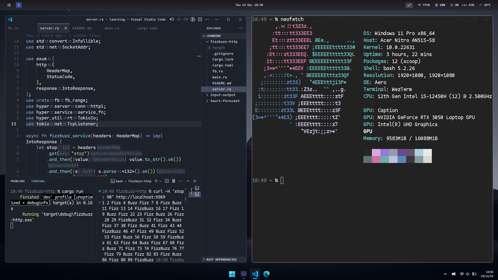

# my dotfiles
- OS: Windows 11
- **Inspirations**:
    - m1chaelwilliams (wezterm config)
    - [this reddit user](https://www.reddit.com/r/unixporn/comments/1hfc6t0/hyprland_i_like_nord/) (wallpaper)
- **Structure**:
    - wezterm/.wezterm.lua (my wezterm config)
    - wallpaper/image.jpg (my wallpaper)
    - bashrc/.bashrc (my bashrc)
    - glazewm/config.yaml (my glazewm config)
- **Assets**:
    - Maple Mono font: [here](https://github.com/subframe7536/maple-font)
    - TranslucentTB: [on the Microsoft Store](https://apps.microsoft.com/detail/9pf4kz2vn4w9?hl=pt-br&gl=BR)

This is pretty simple... i'll me implementing more stuff i use in the future.
## Preview:

