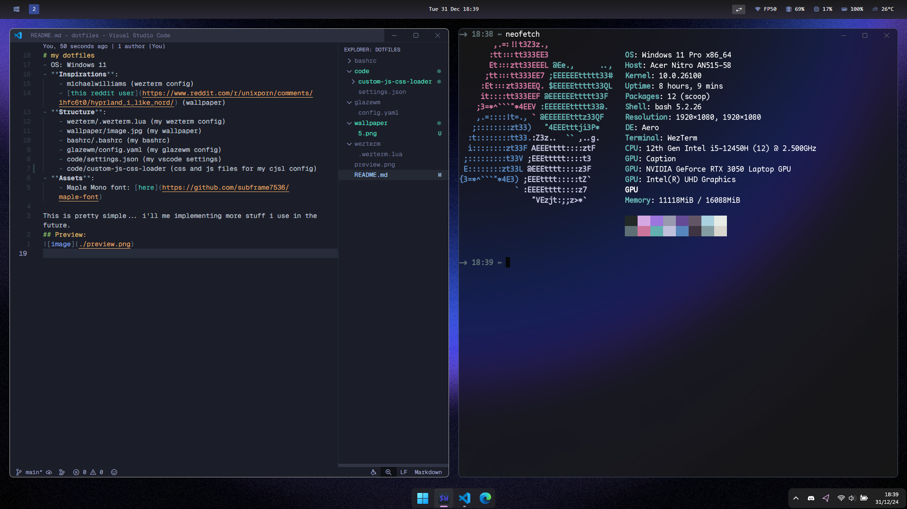

# my dotfiles
- OS: Windows 11
- **Inspirations**:
    - m1chaelwilliams (wezterm config)
    - [this reddit user](https://www.reddit.com/r/unixporn/comments/1hdhgxw/kde_i_switched_to_fedora_after_using_arch_for_a/) (wallpaper)
- **Structure**:
    - wezterm/.wezterm.lua (my wezterm config)
    - wallpaper/image.jpg (my wallpaper)
    - bashrc/.bashrc (my bashrc)
- **Assets**:
    - Ubuntu Mono font: [here](https://fonts.google.com/specimen/Ubuntu+Mono)

This is pretty simple... i'll me implementing more stuff i use in the future.
## Preview:

